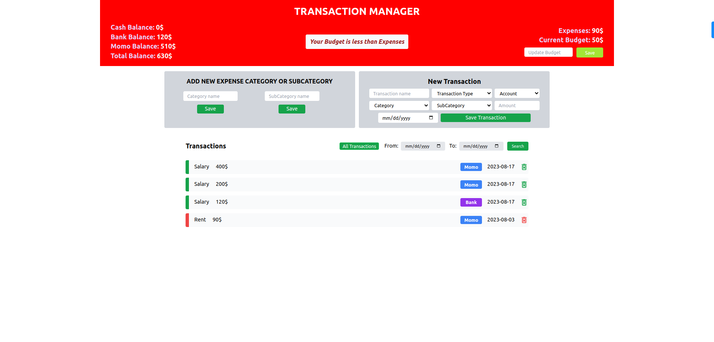

<div align="center">

  <h1>TRANSACTION MANAGER</h1>
</div>

<!-- TABLE OF CONTENTS -->
# 📗 Table of Contents

- [📖 About the Project](#about-project)
  - [🛠 Built With](#built-with)
    - [Tech Stack](#tech-stack)
    - [Key Features](#key-features)
     - [🚀 Live Demo](#live-demo)
- [💻 Getting Started](#getting-started)
  - [Prerequisites](#prerequisites)
  - [Setup](#setup)
  - [Install](#install)
  - [Usage](#usage)
- [👥 Authors](#authors)
- [🤝 Contributing](#contributing)
- [⭐️ Show your support](#support)
- [🙏 Acknowledgements](#acknowledgements)
- [📝 License](#license)

<!-- PROJECT DESCRIPTION -->

# 📖 TRANSACTION MANGER <a name="about-project"></a>

Welcome to our React-based  __Transaction Manager__ repository! Our application offers an intuitive solution for efficiently managing personal transactions across various account types, including cash, bank, and mobile money. With our user-friendly interface, you can effortlessly track expenses, set budgets, and receive instant notifications for budget overruns, balance thresholds, and pending loans. This project aims to empower users with comprehensive financial insights and control, providing a valuable tool for enhancing budget management and expense tracking. 

## APP SCREENSHOTS
<div>
  
  
</div>

<div>
  
  
</div>

## 🛠 Built With <a name="built-with"></a>

### Tech Stack <a name="tech-stack"></a>
   __Front end__
  <ul>
    <li><a href="https://reactjs.org/">React.js</a></li>
      <li><a href="https://redux-toolkit.js.org/">Redux</a></li>
      <li><a href="https://tailwindcss.com/">Tailwind CSS</a></li>
  </ul>

__BACK end__
  <ul>
    <li><a href="https://reactjs.org/">Nodejs</a></li>
      <li><a href="https://nodejs.org/">Express</a></li>
      <li><a href="https://www.mongodb.com/">MongoDb</a></li>
  </ul>

<!-- Features -->

### Key Features <a name="key-features"></a>

- **Transaction Tracking**
- **Expense Categorization**
- **Budget Setting**
- **Loan Tracking**
- **Time-Based Search**
- **Real-Time Notification**
- **User-Friendly interface**<!-- LIVE DEMO -->

## 🚀 Live Demo <a name="live-demo"></a>

- [FRONTEND on VERCEL](https://tranzkt.vercel.app/)
- [BACKEND on Render](https://tranzakt.onrender.com)


<!-- GETTING STARTED -->

## 💻 Getting Started <a name="getting-started"></a>

To get a local copy up and running, follow these steps.

### Prerequisites

In order to run this project you need:
 
 - Code editor
 - Browser
 - Nodejs runtime environment

### Setup project locally

Clone this repository to your desired folder:

```sh
  git clone git@github.com:levy002/tranzkt.git
```

__FRONT END__
### Install all packages

To install all dependencies, execute the following command in your terminal:

```sh
  cd <directory>/client
  npm install
```

### Start the project

:warning: Remember to change the `BASE_URL` to `http://localhost:8080` 
  - The `BASE_URL` is located  in the `.env` file from `<directory>/client/` directory

To run the project, execute the following command in your terminal:


```sh
  npm start
```

__BACK END__
### Install packages

To install all dependencies, execute the following command in your terminal:

```sh
  cd <directory>/server
  npm install
```


### Start the server

To run the project, execute the following command in your terminal:


```sh
  npm run start
```

<!-- AUTHORS -->

## 👥 Authors <a name="authors"></a>

👤 **LEVY UKWISHAKA**

- GitHub: [@levy002](https://github.com/levy002)
- Twitter: [@levy_ukwishaka](https://twitter.com/levy_ukwishaka)
- LinkedIn: [@levy-ukwishaka](https://www.linkedin.com/in/levy-ukwishaka/)

<!-- CONTRIBUTING -->

## 🤝 Contributing <a name="contributing"></a>

Contributions, issues, and feature requests are welcome!

Feel free to check the [issues page](../../issues/).

<!-- SUPPORT -->

## ⭐️ Show your support <a name="support"></a>

If you like this project please leave ⭐️ 

<!-- ACKNOWLEDGEMENTS -->

## 🙏 Acknowledgments <a name="acknowledgements"></a>

I would like to thank CoA GmbH for effering me the guidance.

<!-- LICENSE -->

## 📝 License <a name="license"></a>

This project is [MIT](./LICENSE) licensed.

